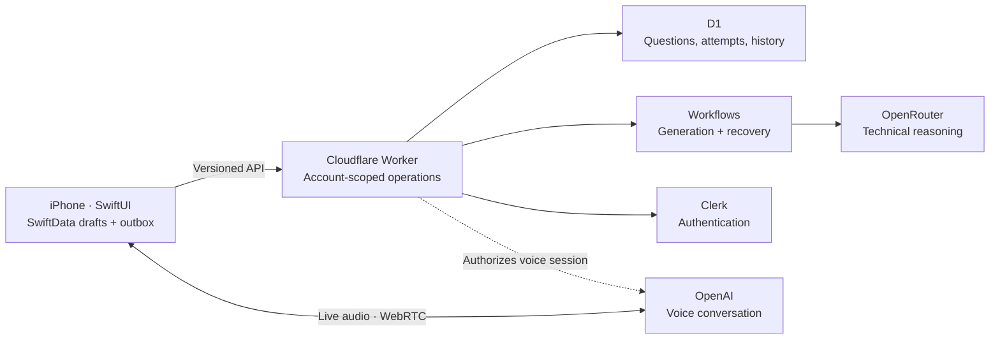

<div align="center">

# Drillbit

**Hard questions. Good company.**

System design practice with an AI interviewer you can think out loud with.

[](https://github.com/dawi369/drillbit/actions/workflows/verify.yml)


[The experience](#the-experience) · [Under the hood](#under-the-hood) · [Run it](#run-it) · [Engineering notes](#engineering-notes)

</div>

## The experience

Technical interviews are a skill you can practise. Drillbit makes room for the messy part: trying an approach, asking a question, changing your mind, and understanding why something works.

- **One problem to work through.** System design questions scoped from Intern to Principal, with visible requirements and optional requests for that session.
- **An interviewer, not a worksheet.** Streamed follow-ups respond to your reasoning. Ask for a nudge or an example when you need one. A little personality is welcome; an interrogation isn't.
- **Write first. Talk when you want.** Live voice continues the same interview. Return to text with your draft intact and the conversation in your history.
- **A library that remembers.** Revisit completed questions, recover skipped ones, and explore related concepts. Generation receives a historical snapshot to help choose what comes next.
- **Come back without starting over.** Cached Home stats, saved drafts, and resumable interviews. The first visit of the day can prepare a question when nothing is waiting; reminders don't spend inference money while you're away.

## Under the hood



**SwiftUI · SwiftData · WidgetKit · TypeScript · Hono · Cloudflare Workers, D1 & Workflows · Clerk · OpenRouter · WebRTC**

Three decisions shape the app:

1. **Native where interaction matters.** System controls, keyboard behaviour, accessibility and a readable interview document. Text and voice share the interview instead of creating two disconnected histories.
2. **The backend owns the rules.** Question generation, account boundaries and lifecycle operations sit behind a versioned contract. A future Kotlin client can use that boundary; no Android client is implemented yet.
3. **Your work survives the network.** Local drafts and an outbox preserve input. Revision checks, durable jobs and explicit conflict recovery keep retries from silently overwriting work. Provider credentials stay on the server.

## Run it

You need **Bun**, **Xcode 26+** with an iOS simulator runtime, and **XcodeGen** (`brew install xcodegen`).

```sh
git clone https://github.com/dawi369/drillbit.git
cd drillbit
bun install --frozen-lockfile
bun run ios:generate
open apps/ios/Drillbit.xcodeproj
```

For a quick UI tour, add `--fixtures` to the **Debug scheme's launch arguments** and run in Simulator. This uses isolated sample data; it does not exercise authentication, inference or real audio.

For live use, configure your own backend and Clerk instance using the [setup and operations guide](docs/operations.md). The configuration templates are [`apps/api/.dev.vars.example`](apps/api/.dev.vars.example) and [`apps/ios/Config/Local.xcconfig.example`](apps/ios/Config/Local.xcconfig.example). Provider calls require funded credentials; voice has separate configuration. Local secrets are ignored and never belong in an iOS build.

With the API configured:

```sh
bun run --cwd apps/api db:local
bun run dev
```

Run the checks:

```sh
bun run typecheck
bun run test
bun run contracts
swift test --package-path apps/ios -j 2
scripts/check-ios.sh
```

`bun run test` runs the backend's Vitest/D1 suite. `scripts/check-ios.sh` also builds and tests the native app in Simulator. Contract generation should leave checked-in contracts unchanged.

## Engineering notes

| Start here | What it covers |
| --- | --- |
| [Interview workspace](docs/interview-workspace.md) | Text-first flow, voice handoff, controls and acceptance |
| [Architecture](docs/architecture.md) | Domain boundaries, persistence, lifecycle and compatibility |
| [Context engineering](docs/context-engineering.md) | Interview context, history and prompt structure |
| [Voice foundations](docs/voice-foundations.md) | Audio transport, transcript ingestion and recovery |
| [Operations](docs/operations.md) | Configuration, deployment and recovery |
| [Acceptance record](docs/acceptance.md) | Observed checks and remaining verification |
| [OpenAPI](packages/contracts/openapi.json) | The shared service contract |

**Status:** actively developed. Text and live voice are implemented; simulator checks, live-service checks and physical-device acceptance are tracked separately. This repository is not a claim of App Store availability or production readiness. The earlier Expo prototype remains in [`legacy/expo`](legacy/expo), outside active build targets.

Found a rough edge? [Open an issue](https://github.com/dawi369/drillbit/issues). Include the smallest reproduction and whether it happened in Simulator or on a phone. Keep private answers and credentials out of reports.
