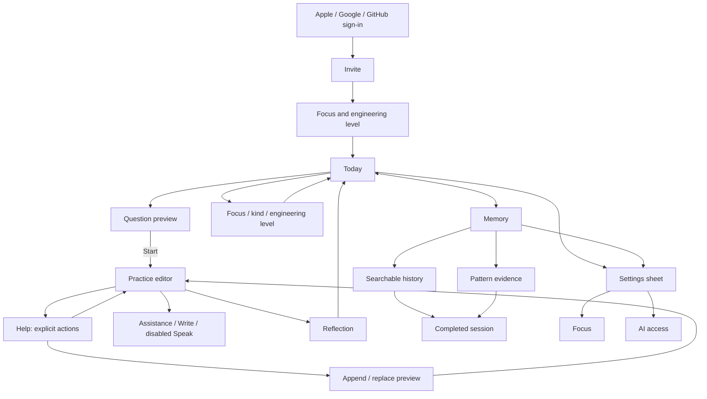

# Drillbit native architecture

This document describes the implemented baseline. The [product council vision](product-vision.md) records the complete direction. The active text-first experience is the Interview room described below; legacy Solo/Coach/Guided contracts remain compatible. Live voice remains deferred.

Drillbit is an iOS 26+ interview practice utility. Today and Memory are the two tabs; Settings is a native sheet. Practice is a full-screen interview with one active answer, explicit sharing, conversation history and an Ask interviewer sheet. Apple keyboard dictation is the speech input for this version. Spoken interviews, subscriptions and Android UI are deferred.

## Navigation

Navigation stays native: tabs select the two permanent destinations, stacks drill into details, sheets contain settings and assistance, and practice owns a full-screen presentation. A local/cloud revision conflict interrupts with an explicit recovery sheet.

## Boundaries

- `apps/ios` owns presentation, native integrations, local drafts and the durable outbox. SwiftData has a versioned schema and an actor-isolated store. Views call AppModel/application services, never SQL.
- `apps/api` owns authenticated account scope, shared lifecycle, generation, coaching, summaries and schedules. Hono adapts HTTP; store operations enforce conditional mutations; AI and Cloudflare Workflows are separate modules.
- `packages/contracts/openapi.json` is the HTTP boundary for Swift and future Kotlin clients. Generate it with `bun run contracts` after contract changes.
- `legacy/expo` is reference material, excluded from the workspace and every new build. Its existing modifications were preserved. The pre-rebuild source snapshot is also outside this checkout at `/Users/dawi/dev/drillbit-before-native-20260908-212600`.

## Practice and sync

A database constraint permits one ready/in-progress challenge per account. Prepared scheduled candidates are separate from active work. Completed answers are frozen; summaries never gate completion. A completion batch checks the expected draft revision and tags the successful mutation with its idempotency command before dependent lifecycle/job writes can proceed. A rejected revision cannot partially complete a session.

Drafts persist locally before cloud writes. The outbox holds the payload, server revision and stable command ID. A newer edit arriving during a network request survives acknowledgement of the older edit. Offline completion remains queued. Revision conflicts preserve the local draft and expose the cloud version for explicit recovery; completed cloud sessions cannot be reopened by a stale client.

Help is a durable job with a stable ID, action kind, assistance mode and draft revision. Opening/dismissing the sheet or switching modes never generates. One active help job per account is enforced in D1. Results survive dismissal; explicit Stop cancels pending/running help, and late results cannot be stored after completion. Help has no automatic provider retries; other existing durable jobs retain bounded retries. The legacy SSE endpoint remains for compatibility, but the native flow no longer uses it.

`practice.ts` owns help and adoption operations. Outline/example text is read-only until explicitly adopted. Suggested drafts have a separate schema field. Preview precedes append/replace; D1 atomically records the source, old/new answer and revision. Undo requires the insertion's exact revision. Later edits invalidate undo. Ambiguous native adoption requests persist their command and input; the editor locks while the same command is reconciled, never silently overwriting a newer local edit.

Completion freezes the answer plus help, adoption and legacy-turn context into `completion_context` in the lifecycle transaction. Summaries read that immutable snapshot. Post-completion reference viewing cannot change reflection inputs. Generated help is conservatively treated as possible exposure; the UI does not claim it measured whether each response was read. Provider work can still incur charges after Stop; application cancellation cannot guarantee provider billing cancellation.

Preparation remembers focus/kind/difficulty per account on this device; the optional instruction affects one generation only. A replacement expires the previous ready question only in the successful insertion transaction, and never replaces in-progress work. Similar-question requests use an owned completed session's reflection and assistance context. They create fresh questions, not mutable revisions of a completed answer.

## Accounts and credentials

Clerk JWT template `drillbit` must contain `aud: "drillbit"`; API verification checks issuer, audience, signature and expiry. Authentication does not grant practice access until a single-use invite is redeemed. Every user-owned SQL operation is scoped to the internal account ID.

Managed OpenRouter keys are Worker secrets. BYOK is OpenRouter-only and AES-GCM encrypted, with account/credential binding in authenticated data. Keys never appear in public responses, prompt contexts or logs. Replacing/removing a key cancels dependent pending jobs; invalid BYOK never falls back to managed access. Removing an account revokes widget credentials immediately and schedules durable deletion of application data and Clerk identity.

The widget receives only a minimal challenge projection through App Groups or a read-only, expiring device token. Full answers, reflections and provider credentials are not widget payloads. Device credentials are stored in the shared Keychain group. Clerk session credentials use the application-only Keychain group.

## Scheduling and learning

The scheduler prepares a candidate 15 minutes before the configured local daily slot. It never expires in-progress work, keeps an existing ready question on generation failure, avoids a backlog of missed days and pauses unattended generation after seven days of inactivity. Calendar calculations use IANA timezones and Temporal, including DST. Local reminders carry generic copy. WidgetKit and background refresh remain best-effort; neither drives AI generation.

Context assembly preserves the current answer and latest request and trims older evidence to a bounded character budget. Generation, help, examples and reflection outputs are schema validated. Generated question specifications include kind, target skill, visible constraints and ambiguity policy. Private evaluator criteria are derived from the visible prompt/constraints rather than a separately generated rubric; internal criterion fields are excluded from public challenge projections. Repeated memory patterns need evidence from at least two sessions. Readiness percentages and synthetic proficiency scores are intentionally absent.

## Native rules

Use system typography, semantic colors, SF Symbols and system component geometry. Custom spacing uses 4-point increments; custom surfaces use a 12-point radius. Keep one main action per state and the editor as the dominant practice surface. Support Dynamic Type, VoiceOver and standard keyboard/dictation behavior. No Expo, web views or third-party UI suite in the new application.

## Model and prompt policy

`google/gemini-2.5-flash-lite` is the only provider model for managed and BYOK requests. The provider enforces the constant independently of settings or queued job snapshots. Migration 0004 updates stored preferences; reads normalize older snapshots. The native model picker is removed. All actions use versioned `companion-v1` task instructions with a shared concise, warm tone layer. Tone is inspired by the user's Poke reference; it does not reproduce private prompts.

Run `bun scripts/check-practice-model.ts` and `bun scripts/check-practice-model.ts --edges` for synthetic live checks. They use the configured OpenRouter key and incur provider usage. Schema/boundary success is separate from human judgment of correctness and tone; see the current acceptance record.

## Contextual companion

[Companion specification](companion-vision.md) defines the implemented native bottom companion and mode boundaries. `InterventionPolicy` is pure; an observable coordinator owns activity, timing and presentation freshness. Views forward events; `PracticeCompanion` integrates persisted commands, account-scoped delivery receipts and HTTP. No voice transport is present.

Migration 0005 adds companion context, normalized interaction cycles, captured automatic requests and delivery receipts. Context mutations use revision checks and idempotency keys. D1 enforces shared automatic budgets, cooldown and duplicate-cycle rejection; `COMPANION_AUTO_ENABLED` controls rollout independently of manual help. Completion freezes pending delivery evidence atomically with the final draft. Generated, shown, uncertain and adopted help are distinct; unknown exposure is never classified as independent work.

Swift DTOs and the public OpenAPI contract are additive. Existing explicit-help clients remain supported. Native recovery uses account-scoped cached payloads rather than changing the stored-draft schema. Every automatic presentation also checks the local edit generation, mode epoch and captured context; reopened pending jobs are historical, not automatically fresh. See the acceptance record for observed checks and remaining device/product validation.

## Engineering levels and timezone preferences

Settings, onboarding and preparation use Intern, Junior, Mid-level, Senior, Staff and Principal (`intern`, `junior`, `mid`, `senior`, `staff`, `principal`). Optional `engineeringLevel` is additive to legacy `difficulty`; absent values normalize easy→junior, medium→mid, hard→senior. Legacy settings writes preserve a stored level. Explicit generation difficulty without a level maps that request only; new clients always send the level. Queued old snapshots normalize on execution, and newly generated challenges retain their level. Historical questions are not rewritten. Level affects visible question scope, never hidden evaluation requirements.

The native timezone list stores IANA identifiers, includes saved/device zones and offers a one-time device-zone selection. Saving does not follow subsequent device-zone changes. Daily clock minutes remain fixed; D1 scheduling and local calendar notifications use the selected timezone with DST rules. Settings retain Done-to-save behavior. LLM provider is the renamed AI access destination, with the same fixed Gemini/OpenRouter configuration.

## Compact Today summary

When no question is active or generating, Today shows Completed, Last 7 days, the latest completed session title with its recorded engineering level and localized completion date/time, and New question. `/v1/memory` adds optional `statistics` with `completed`, `lastSevenDays` and `asOf`; counts are account-scoped across all completed challenges, independent of the 100-session history page. Last 7 days is a rolling 168-hour window at `asOf`. Older cached payloads show unavailable counts rather than inferred totals, and snapshots older than five minutes show their update time. Accessibility text sizes stack the metrics vertically. Existing active-question navigation is unchanged.

Last-session metadata uses the level captured on that question, never the current settings. Legacy sessions map recorded Easy/Medium/Hard to Junior/Mid-level/Senior. Records missing both fields show Level not recorded. Absent or invalid completion dates are omitted.

## New-question brief

Preparation uses shared focus presets (including the user's current custom focus), target-level and format pickers, a visible optional request and Prepare question. Each presentation initializes from global focus/level with auto format and empty request. Local selections never update Settings or persist as subsequent defaults. Prepare generates a preview; Start still begins the attempt. Review's Practise this next opens the same sheet with removable source feedback and a link to session details. The server's existing follow-up snapshot now includes bounded submitted answer and delivery/capture facts alongside adoption history; generation is instructed not to infer mastery or change the requested level from recent history.

## Persistent Today and question previews

Today always renders activity counts and latest-session metadata. A separate compact area renders generation status or the ready/in-progress question title, topic, recorded level and Preview/Resume action. Full prompts are absent from Today. Native scrolling and bottom safe-area padding keep actions reachable above tabs.

QuestionFlow coordinates preparation and preview inside one sheet. Explicit preparation shows loading then the exact generated question in that sheet. Close preserves the question/job; backgrounding dismisses the flow and never reopens it. Scheduled/background results only update Today. Preview shows only the title and full prompt, with intrinsic multiline text height inside its scroll view; topic, level and interview style remain outside this reading surface. The body scrolls independently of a safe-area-inset Start/Choose another footer. Generation uses a full-width, vertically centered loading status; inline loading surfaces reuse the same spinner/text alignment. Start errors remain inline; the editor is presented after server Start succeeds and the sheet has dismissed. Resume retains offline draft recovery. Account checks prevent late results being presented under another account.

Existing generation/detail/Start APIs and ready-question replacement semantics are reused. Local failures preserve the submitted brief for Review preparation; unresolved backend jobs retain existing job reconciliation. No schema or public API change. This supersedes the earlier Today full-question layout and per-question cache defaults.

## Interview room — 9 September 2026

The active native workspace is now `InterviewView`, replacing the Solo/Coach/Guided selector with explicit turn-taking. The older companion implementation and public APIs remain for compatibility and historical assistance; its timers are not mounted in the new workspace. Today and the preview route are unchanged. Start interview opens a writing canvas; Share answer commits a snapshot, then a separate durable job produces a single follow-up. The … menu holds Finish interview, Ask interviewer, an editable Interview style list and Full question; the bottom bar retains voice and Share answer. Ask interviewer opens clarification, nudge and read-only example actions without sharing or replacing the draft. The active document preserves prior turns inline; the dedicated transcript remains available in completed-session detail. Live voice remains disabled.

Interview style is a temporary preparation choice and can be changed from the workspace menu: Quick, Standard (default), In-depth. It is stored with generated questions as `quick`, `standard`, `in_depth`, independent of engineering level and global settings. Older questions default to Standard. Workspace choices persist locally per account/attempt and are sent as an optional `style` on the next explicit interview command. The server captures that style in generation context and atomically stores it with the accepted turn; stale or duplicate commands cannot change it independently. Requests without a style retain the saved value, and existing turns remain unchanged. Quick permits one initial follow-up, Standard up to two, In-depth up to four before a deterministic wrap-up offer; the model may offer an earlier wrap-up. These are ceilings rather than mandatory rounds. Keep going explicitly requests an additional question, followed by another wrap-up offer. No automatic completion or inference from typing pauses.

Migration `0006_interview.sql` adds ordered `interview_turns` linked to durable jobs. `POST /challenges/{id}/interview` accepts an answer/clarification/hint/example/continue command with draft revision, current prompt identity and idempotency key. A D1 batch creates the turn/job and increments the session revision; only an answer clears the active draft. Competing requests cannot share the same revision or leave a partial turn. Account-wide single-flight and per-account/attempt limits bound requests. `POST /challenges/{id}/interview/{turn}/retry` retries a failed response with a new job while retaining the original committed answer. Workflow automatic retries are disabled for interview inference.

Native pending commands are persisted before submission in the account-scoped DiskStore cache. Ambiguous requests retain their original command and lock submission until reconciled. The existing draft outbox preserves offline typing and conflicts. Restoration reads existing state; replay does not create another answer or paid job. Completion remains revision checked, cancels pending interview work and freezes the ordered transcript alongside any unshared final draft. A late model response cannot alter a completed interview. Generated assistance is conservatively recorded as unknown exposure; no claim of independent work is inferred from missing receipts. Examples in the new Ask sheet are read-only; the legacy revision-checked adoption APIs remain supported.

The sole model is Gemini 2.5 Flash Lite. `interview-v1` separates follow-up/wrap-up schemas from clarification/help replies, preventing a clarification response from advancing the turn. Wrap-up copy is normalized by the server. Long histories are bounded by dropping oldest context turns with an explicit omitted-turn count; complete stored history remains intact, and reflection instructions restrict conclusions to available evidence. Current answer and current prompt are retained. Broader long-interview reflection quality remains a product acceptance concern.

Interview submission waits for an in-flight draft sync and then drains the current challenge only. Unrelated pending drafts do not block sharing; a real local conflict or unsynced current draft still does. Failed pre-submission sync retains the action for explicit Retry. Save-status captions are absent from the workspace, and keyboard focus never changes the question disclosure state. API transport/token injection lets native regression tests exercise this real controller/outbox path without Clerk or paid model calls.

## Continuous interview document — 9 September 2026

The interview workspace is one vertical document: the original specification, chronological exchanges, and the current growing answer. `InterviewExchange.document` projects existing durable turns; an answer’s follow-up becomes the next exchange’s question exactly once. Clarification, nudges and examples stay with their question and are not presented as candidate answers. No API or database change is needed.

Each exchange has one manual disclosure. Everything starts expanded. Collapsed rows show a question excerpt with a trailing 20-percent fade only when needed, plus a separate unfaded chevron; accessibility text uses up to two lines and native truncation. Entire headings are disclosure buttons with complete VoiceOver labels and expanded/collapsed values. Typing and polling never fold content. An explicitly accepted Share folds the question just answered; failed submissions leave its disclosure unchanged. Folding only hides question wording, never submitted answers or recovery controls. Disclosure choices and the document offset are cached per account/attempt on this device; returning restores them. Offset restoration is a reading convenience, not a shared server revision.

The header uses the actual question title, Close and …; Finish interview is first in the menu with confirmation. Full question expands the original exchange and scrolls to its heading in the same document; there is no separate original-question sheet. Active history no longer requires a Conversation sheet. Wrap-up appends to the document, preserving all earlier work and offering Finish & review / Keep going.

A non-scrolling native UITextView provides growing multiline editing and caret/selection geometry within SwiftUI. The outer ScrollView owns vertical scrolling, including the full original specification. UIKit first-responder and editability changes are deferred until after `updateUIView` returns: resigning synchronously re-enters SwiftUI’s responder graph and can stall Share and scrolling. The SwiftUI-only multiline field failed the long-answer caret check, so the small native bridge measures intrinsic height and reveals the caret above the keyboard without moving selection. User scrolling takes priority; ordinary layout updates do not imply following a response. No custom motion or transparent surface is required.

A submitted answer remains in place while sharing, then appears as a committed snapshot in its exchange. Pending and failed response UI stays beside that snapshot, including a reachable retry when folded. A response reveals the next question only while the person follows the active end. If they scroll back or inspect a sheet, an explicit New follow-up / Wrap-up ready action appears instead. While older history is in view, Return to answer replaces Share to prevent sending an offscreen draft. The existing outbox, idempotency, conflict and completion safeguards remain unchanged.

### Sent answer and interviewer response

Each completed answer is rendered immediately before the follow-up it produced, within the same visual block. The prior question disclosure no longer owns the answer’s visibility. Pending/failed answers remain visible beneath their question; successful response arrival places the same durable answer snapshot beside its reply. A divider separates question wording from the initial editor and separates completed exchange blocks. The wire format, stored turns, revision checks and pending-command recovery are unchanged. This supersedes the earlier whole-exchange folding behaviour.

### Reply-driven answer folding and latency — 10 September 2026

Submitted answers stay open while awaiting a response or after failure. Once a completed reply exists, the answer becomes a one-line disclosure above that reply. Manual answer expansion persists in the account/attempt reading cache (`expandedAnswers`, optional for compatibility). The original question’s collapsed excerpt is its title. Question and answer disclosures remain independent.

All managed and BYOK calls now use `google/gemini-2.5-flash-lite`, disable reasoning and sort compatible OpenRouter providers by latency. Schema enforcement remains required for structured calls. Settings accepts the previous 3.1 model identifier for old clients, normalizes writes/reads and queued jobs to the fixed model, and introduces no migration or model picker. Native response polling runs once per second only while a job is pending (foreground fetches only), reducing the previous three-second polling delay.

## Home and the future voice transcript boundary — 10 September 2026

Home replaces Today in navigation and user-facing recovery copy. It remains a plain native, scrollable hub: completion counts, last-seven-days count, current ready/in-progress question and preparation/progress/recovery controls. The latest-session summary is removed from Home; historical sessions remain in Memory. The workspace send action is a 44-point arrow-up control paired with the disabled waveform control. Wrap-up uses a checkmark with an explicit VoiceOver label and the existing confirmation.

`FinalizedInterviewAnswer` captures a stable turn UUID, account, challenge, prompt identity and finalized text. `InterviewController.receiveFinalizedAnswer` is the entry point for a future voice adapter: it checks captured identity, blocks stale prompts or an unrelated written draft, and reuses the same draft outbox, idempotent interview command and response-history pipeline as typing. Duplicate accepted events are ignored only if their text matches; mismatched duplicate events are rejected. Pre-submission retry preserves the event’s command UUID. Accepted answers and generated replies are already stored as ordinary interview turns, so exiting voice needs no second transcript import or merge.

Only finalized user answers enter this API. Partial recognition stays inside the future adapter; clarification/discussion is a separate destination and must not be passed as an answer. The agent response continues through the existing backend and appears in the same text history. Recording, audio permissions, speech recognition, playback, cancellation/barge-in and externally generated live-model transcript import remain unimplemented. Voice stays disabled. This is a tested input boundary, not a working voice session.

### Resume restoration and quiet waiting — 10 September 2026

Disclosure state is read from the account/attempt cache before document content becomes interactive, rather than after the controller’s asynchronous refresh. Restoration cannot overwrite a new disclosure tap. Initial turn hydration is excluded from live-reply navigation. The collapsed original shows its title (up to two lines) and a three-line description; Full question still expands it in place. Sharing and pending interviewer states use inline secondary text with no progress spinner, including the Ask sheet. Explicit Share and completed-answer folding rules otherwise remain unchanged.

### Skip confirmation and disclosure spacing — 10 September 2026

Skip uses a standard alert with Keep practising and destructive Skip question actions, avoiding a confirmation popover anchored to a menu item that has disappeared. Expanded question headers align their content at the bottom of the existing 44-point tap target, with an 8-point body gap; expanded answer headers use a 4-point gap. Collapsed previews and native accessibility labels remain unchanged.

10 September 2026 follow-up spacing refinement: expanded exchanges use 4-point stack spacing and vertically centred disclosure headers, reducing the blank space above Follow-up while retaining 44-point tap targets. Collapsed exchanges retain their existing 8-point spacing. Sharing and waiting status captions are removed from the workspace and Ask sheet; pending-command locks, saved answers and error/retry controls remain unchanged.

### Interview streaming — 10 September 2026

Send immediately projects a collapsed outgoing answer and a stable Interviewer disclosure row. The existing persisted command/revision mechanism remains authoritative: ambiguous submission failures retain that command; definite rejection restores the editor. Opening a disclosure during inference is respected when the result completes. New interviews never suggest wrap-up; Finish remains explicit. Historical wrap-up outcomes remain decodable.

Workflow generation now consumes real provider SSE, extracts only complete JSON string fragments, and persists provisional text in additive migration `0007_interview_streams`. Account-scoped GET `/v1/challenges/:id/interview/:turn/stream` emits changed `{status,text}` snapshots without starting inference. Publication is capped to roughly one write per 150 ms; subscribers check every 200 ms. Full schema validation and the existing lifecycle checks still gate final transcript commitment. Partial text is not a completed answer. Disconnecting a subscriber does not cancel its durable job; explicit retry reconnects, and completed challenge detail restores the final transcript. No fabricated typing replay is added; very short replies can finish between snapshots.

The native controller tracks the pending job identity, rejects callbacks for another account/job, and reconciles completed detail after submission settles. Reduced Motion disables the collapse animation. No progress spinner, waiting caption, sound or automatic wrap-up panel is shown.

## System-design library foundation — 10 September 2026

Home and Library are the two tabs. Focus is removed from onboarding, Settings and preparation; all generation, including legacy request shapes, normalizes to System design. Preparation offers a temporary Practice area (Automatic or one canonical concept), engineering level, interview style and optional request. There is no format picker.

Migration 0008 separates immutable `questions` from existing challenge/attempt identities through `question_attempts`. Repeated Start creates a new challenge/session linked to the same question. Old attempts remain readable. Question-pool eligibility has its own revision and durable idempotency records. Skip excludes the question, Add back restores eligibility without starting or generating, and explicit repeat Start respects the one-active-attempt constraint. Generation may reuse an eligible question at the requested level/area without a provider call. It consumes eligibility when the ready candidate is created. Otherwise deterministic selection prefers less-covered primary concepts at the requested level, avoiding the latest two concepts; explicit area selection wins. Completion counts are evidence of practice volume, not proficiency.

The versioned taxonomy has 24 server-owned concept IDs, labels, categories, aliases and descriptions. New generation returns a 1–3 word scenario and one list of 1–3 concept/evidence entries; the primary ID is constrained in the actual response schema. Each evidence entry references prompt index 0 or a one-based constraint index. The server derives secondary IDs and validates uniqueness, primary inclusion and valid references. This avoids redundant model-generated arrays or fragile copied quotation matching. The references identify source requirements; semantic relevance remains a model-quality evaluation concern. Private tag evidence and selection snapshots are excluded from public projections. Inferred tags are absent from unanswered previews.

Library APIs provide account-scoped pagination, search, OR concept filters combined with level/date filters, immutable question detail with paginated attempts, revision-checked eligibility updates, repeat Start and factual per-concept coverage. The native list caches first pages/details, clearly labels offline/incomplete data and queues eligibility changes in the local actor-backed store. Library replaces the earlier free-text recurring-pattern presentation; existing reflections remain in attempt detail. Generation uses up to ten compact recent signatures and bounded reflection excerpts, with explicit request and selected area preserved. A versioned observation contract is reserved, but no new skill assessments, review intervals or mastery scores are generated in this phase.

Bootstrap includes `practiceEpoch`. Native sync checks bootstrap before replaying the outbox, and a changed epoch clears only that account's practice drafts, caches, pending commands and reminders, preserving authentication/preferences. This adds one bootstrap request before a sync pass; future transport/context work may optimize that guard without permitting stale replay. The development reset preserved account/settings/provider configuration and cleared old practice data. `practice_epoch.enabled` is a maintenance gate for mutations and scheduling. Exact-content duplicate generation is rejected without replacing existing work. Existing interview streaming, completion snapshots and assistance exposure remain authoritative.

## Library refresh and interview chrome — 10 September 2026

Library keeps account/filter-scoped in-memory snapshots, backed by the existing account-scoped disk cache. Superseded by launch preloading below; page entry no longer revalidates. Request identities reject superseded filter responses, and refresh failures retain displayed results. Practice epoch changes clear these snapshots. Question details also hydrate from cached state before fetching.

Interview navigation displays at most two words from the recorded scenario (legacy fallback: System design); the full title remains in the original-question section. Close remains directly accessible. The safe-area footer reserves keyboard/caret clearance but draws no full-width background: only the disabled voice and send/finish controls have surfaces. History-return shortcuts are removed; late responses continue to respect manual scrolling.

## Launch-preloaded Library — 10 September 2026

Launch prepares the first 25 completed and 25 skipped questions, their first attempt pages, and each question’s latest full attempt (five concurrent question fetches). Account-scoped disk snapshots provide offline fallback. Pages consume memory snapshots without entry/pull-to-refresh requests; uncached filters and older pages load on demand and remain cached. Publication happens after detail hydration. Ordinary foreground/bootstrap refresh does not rewarm the Library.

Successful completion acknowledgement starts an account-scoped watcher outside the results view. Once the server returns stored feedback, it refreshes the Library snapshot and invalidates cached filters. The watcher is bounded to 90 two-second polls; a later cold launch also reconciles the database. Failed/unacknowledged completion cannot trigger this refresh. Skip refreshes only the skipped collection; pool acknowledgements patch cached eligibility without refetching. Close/navigation does not invalidate Library data.

## XML interviewer context — 10 September 2026

The active Standard interviewer uses a versioned XML prompt, account-scoped recent-history snapshots and committed user/assistant role pairs. Each new interview job pins its prompt edition and history; XML escaping keeps candidate content separate from policy. Generation consumes the same bounded history for variety. Standard is the sole active style; legacy style inputs normalize for new turns without removing historical enum values. Runtime prompt administration remains future work. See [context engineering](context-engineering.md) for provenance, limits and editing boundaries.

## Interview document motion — 10 September 2026

Structural exchange/disclosure/draft changes use a shared 320 ms ease-in-out transition; arriving rows fade and streamed text height settles over 180 ms without text replay. New-exchange scrolling waits 340 ms for keyboard/document changes, uses an animated bottom anchor, and cancels when the target changes or the user browses history. Restoration has no entrance animation; Reduced Motion disables these animations. Busy clarification/help no longer removes the draft editor: it remains in place but disabled. Answer submission still replaces the editor with the durable outgoing snapshot, and final response commitment reveals the next editor smoothly.

### Disclosure clipping correction

Manual question/answer disclosures use a faster 180 ms ease-out independently of the 320 ms response transition. Expanded text is intrinsically measured inside an explicitly sized, clipped reveal region. It cannot draw at its final height over following rows while the surrounding layout is still opening. Hidden content is excluded from hit testing and accessibility. The initially expanded view uses intrinsic height until measurement, avoiding an empty first frame.

### Unified original-question disclosure

The original description is now a single persistent body-font text view, clipped between measured three-line and full heights. There is no duplicate excerpt/full-description swap or immediate opacity removal. The title remains in its stable header. Manual disclosure and Send both use the same 220 ms ease-in-out motion; the preview changes to secondary color without reflowing to another font. This supersedes the earlier original-question reveal implementation.

### Submitted-answer disclosure

Original questions and submitted answers share the same persistent-text, measured-height disclosure component and 220 ms ease-in-out timing. Answers retain a one-line preview and primary text color. Send first lays out the opaque submitted snapshot, then compresses it and the answered question together; newly submitted blocks do not replay an insertion fade. The short handoff is transient view state, independent of durable submission and stream recovery. Restored answers keep their saved disclosure state.

### Content-sized transcript rows

Answer and interviewer rows compare intrinsic SwiftUI body-text height with a measured one-line preview at the actual available width. One-line turns have no disclosure button or collapsed/expanded accessibility state; longer turns retain the shared 220 ms disclosure. Measurements update with text, width and Dynamic Type. Disclosure buttons overlay the label/first-line region with a 44-point hit target instead of reserving a separate tall header. Transcript divider spacing is 12 points, document top padding is 20 points, and the original-question label/title gap is 4 points.

### Stable transcript labels

Original-question, You, Interviewer and draft labels use a shared nonanimating label view. They retain fixed typography and top-leading alignment, and opt out of local animation transactions. Whole exchange and draft insertion fades were removed so an ancestor cannot fade the labels. Content disclosure still uses its existing measured-height motion; labels travel with normal document reflow and scrolling rather than floating over other rows.

## Optimistic local actions — 11 September 2026

Skip first stores an account-scoped command and the latest editor text in SwiftData, then dismisses the workspace and removes its Home card without awaiting HTTP. AppModel drains skips in the background before draft writes, reusing the existing repeat-safe Skip endpoint. Acknowledgement retires pending draft uploads while retaining the local answer. Queued skips mask stale bootstrap data after relaunch; a local tombstone also rejects late interviewer presentation. Network failures leave the command pending for reconnect/manual sync. New generation waits for queued skips to drain before requesting a paid job. Sign-out pending-write checks include these commands.

Add back to pool now publishes local eligibility immediately after durably enqueuing the existing revision-checked command. Library hydration reapplies pending eligibility so refresh does not undo the optimistic state. A 404/409 response reconciles Library data and exposes the server error; transport errors leave the command queued. Work arriving during an existing sync receives a subsequent drain pass.

This pattern applies to confirmed local intent, not fabricated server results: Start, generation, and completed feedback retain their acknowledgement boundaries. No backend schema or contract changes.

## Inference latency pipeline — 11 September 2026

All provider calls send their JSON schema once through `response_format`, rather than duplicating it in the system prompt. Strict schema validation, the fixed model, quota accounting and latency-based provider routing remain intact. All inference jobs load their job/account state in one scoped query. HTTP-triggered workflow enqueue uses request-scoped `waitUntil` after durable D1 job creation; responses no longer wait for workflow creation acknowledgement. Scheduled reconciliation still recovers dispatch failures. This does not bypass Workflow startup or its durable execution boundary.

New interview answers set optional `saveDraft=true`: the existing revision-checked D1 batch commits the submitted text into the turn and clears the answer atomically, without a preceding draft PUT. Legacy clients still require their text to match the synced draft. Native submission waits for any existing autosave/sync, then atomically persists the local answer and outgoing command. General draft sync skips attempts with an outstanding interview command. Local text is cleared only after the server acknowledges that submission; conflicts/replays retain the existing safeguards. The backend must be deployed before distributing this native path.

Interview settings/history reads run concurrently. Stream snapshots use one account-scoped join, reusing the initial snapshot when opening SSE. A single coalescing writer persists partial text without blocking provider-token consumption; the final validated text waits for prior writes, and write failure aborts the provider stream. Transport still relays durable D1 snapshots at 200 ms intervals; this is not direct provider-to-client streaming.

Generation, help and visible review polling checks every 500 ms for the first ten seconds, then every 1.5 seconds, preserving existing timeout windows. Generation avoids its duplicate full sync and publishes a confirmed question before a background Home refresh. Backend logs report queue-to-execution, credential/quota setup, provider-header and first-text timing without practice content. Native OSLog reports Send-to-first-text for new submissions. `scripts/measure-inference.ts` measures synthetic provider-only samples; it cannot establish end-to-end app latency.

## Cache-first Home hydration — 11 September 2026

After verifying the cached account belongs to the current Clerk subject, launch restores statistics, the first completed/skipped Library pages and their cached details, and topic taxonomy before publishing Home. Pending eligibility changes overlay those snapshots. Network refresh retains visible content; statistics refresh before Library/network maintenance and after completed feedback has been stored. Account changes, sign-out and practice-epoch resets invalidate hydration; request versions and account/epoch checks reject stale statistics responses. Uncached statistics show a compact loading message rather than invented counts or dash placeholders. No API or database change.

## Session restoration before root routing — 11 September 2026

Root routing distinguishes initial session restoration from signed-out state. A neutral native surface remains until Clerk is loaded and the matching account cache is hydrated; authenticated launches without cache also await bootstrap. Cached Home can appear before network maintenance completes. A Clerk readiness timeout or authenticated bootstrap failure offers Retry without rendering sign-in. A loaded Clerk client with no user reaches Welcome normally. Existing subject/account cache checks and sign-out behavior remain authoritative.

## Coordinated disclosure placement — 11 September 2026

Interview disclosure height and surrounding document placement inherit one SwiftUI `.smooth(duration: 0.3, extraBounce: 0)` transaction. The text component no longer overrides timing locally, and row labels no longer suppress inherited placement animation. Labels retain identity transitions and fixed typography without fades. Structural insertion shares the same curve; streaming retains its separate short growth timing. Reduced Motion and restoration/staging still disable document animation. This supersedes the earlier 220 ms disclosure and label-transaction suppression decisions.

## Practice personality and voice admission — 11 September 2026

New interview jobs pin `interviewer-standard-v3`; V2 remains resolvable for queued jobs. XML policy/reference material is separated from natural conversation messages and the final utterance, so the problem statement is no longer bundled into every conversational request. A follow_up outcome represents the next turn, including social replies; no public response schema changes. Gemini 3.1 Flash-Lite is the single active model, with legacy 2.5 settings accepted and normalized.

Finalized voice-answer admission normalizes edge whitespace and rejects inactive/hidden or finished workspaces, retaining existing durable command/replay and draft guards. Voice stays disabled. See `docs/context-engineering.md` for researched personality decisions and partial live acceptance, and `docs/voice-foundations.md` for remaining audio-specific requirements.

## V4 conversation routing and response ownership — 11 September 2026

New interview jobs pin V4. A narrow whole-message social recognizer changes inference context only; it does not alter persistence, replace replies or drop historical data. Main context uses escaped XML reference data explicitly marked untrusted, followed by native conversation roles. V4 model output is `{move,text}`; the private move is validated then discarded. The server determines public follow_up/reply from the accepted action. Models cannot choose wrap_up or change lifecycle. Old V2/V3 editions retain their schema/assembly paths. Public API, Swift DTOs, D1 schema and streaming text protocol are unchanged.

Substantive V4 calls use low reasoning; recognized social messages and other operations retain disabled reasoning. There is one provider call per turn. Cost/latency and reviewed sample acceptance are in `docs/personality-acceptance.md`.

## Text-practice completeness — 11 September 2026

The current product is Home / Library with the Interview room. This section and the [completeness ledger](product-completeness.md) supersede older Today/Memory and model-name descriptions above. Current model is Gemini 3.1 Flash Lite; live voice remains disabled.

Reflection output `feedback-v2` adds required model-side evidence and nextExercise while public stored fields remain optional for old clients/records. Evidence is accepted only when its quote occurs in submitted candidate text and its concept is on the question. Quote validation is not semantic proof; observations remain model feedback. The server does not certify independence from missing delivery history. New reflections may have an empty improvement when the stated requirements are met. No historical sessions are rewritten. The last 100 completed-session observations travel in the existing cached memory response, with source IDs and dates.

Concept selection version 2 rotates exploration, feedback and 14-day revisit opportunities at the selected level, excludes recent generated primary concepts, and never treats skips as weakness. Feedback comes from the latest observed session per concept; explicit selection wins. Source-linked follow-ups prefer the recorded weakness concept and use the existing generation/preview/start route.

`GET /v1/account/export` paginates both sessions and question records with independent creation cursors and a fixed creation watermark. It uses authenticated account scope and public projections, includes eligibility, and excludes provider/device credentials and private evaluator fields. This is a readable data export, not an atomic database backup. Native export flushes pending work before fetching and checks account identity on every page.

Appearance is a local System/Light/Dark preference. Notification/widget links select Home rather than calling Start. Authorized reminders reconcile after bootstrap without prompting on launch, using the saved IANA zone. Deleting a session invalidates its persisted Library snapshots. Reflection waiting terminates with an explicit check/retry path instead of an endless spinner.

HTTP diagnostics log only method/status/duration/request ID. Inference usage records the actual prompt edition and charges even if output validation fails. MetricKit logs crash/hang counts locally; raw diagnostic payloads and practice content are not transmitted.

### Inline interviewer help

Ask interviewer remains in the workspace menu as a compact action sheet: Give me a nudge, Show an example, and an optional clarification field. Accepted commands dismiss the sheet only after local persistence; pre-submission failures retain its input. Help replies render incremental stream text in the existing conversation, with no duplicate sheet history. Help submissions preserve the unfinished answer and reuse existing revision, recovery and account-scoping contracts.

## Live voice integration — 12 September 2026

The native interview now has a gated WebRTC voice mode; see [voice foundations and acceptance boundaries](voice-foundations.md). Migration 0009 adds account-scoped voice sessions, immutable transcript fragments and idempotent delegation records. A voice session reserves an ordinary ordered interview block backed by a completed `voice` job; it never passes speech through `requestInterview` and therefore cannot generate duplicate text replies. Public interview turns add optional `voice` fragments and the `voice` kind; existing text DTOs remain valid. Completion snapshots include fragments, and feedback checks user quotes against those fragments. Versioned native and backend paths must be rolled out together before enabling voice for clients that understand the new turn kind.

Local voice outboxes are included in account pending-write checks. D1 owns transcript and lifecycle state; provider event IDs identify fragments, while app command UUIDs identify sessions. Ending voice leaves the attempt and written draft in place. `VOICE_ENABLED=false` retains text practice while live provider and device acceptance remain open.

### Dedicated voice room

`InterviewView` is the stable owning shell for both writing and voice. Its `ZStack` switches presentation without replacing the controller or `LiveVoice`; route children do not start or tear down sessions. Explicit entry starts once, selector changes only change visibility, and leaving stops local capture/playback synchronously before asynchronous closure. A generation check after durable startup persistence prevents cancellation from resurrecting a connection. Repeated End while already ending is ignored.

The room reuses the original-question component and disclosure state. Question and Conversation retain independent scroll positions within the room; transcript rows project the same immutable fragments used in writing. Manual transcript scrolling disables automatic following; Latest returns to the end. There is no additional transcript store, API or migration. A brief bottom-leading surface transition is independent of networking; Reduced Motion uses opacity only. This is a restrained page transition, not a stretched waveform animation.

Mute and End remain in a bottom safe-area inset. Back has the same local audio-stop behavior as End. Draft editing and completion remain gated only while the existing voice closure/outbox conflicts; failed synchronization is recoverable from writing. App/account/attempt lifetime guards remain authoritative. No page appearance reconnects or replays a greeting.

### Text-first interview refinement

See [interview workspace](interview-workspace.md) for the current screen/control decisions, replacing the voice selector described above. Voice now shows a canonical question reference plus latest exchange, with History/Live over the shared transcript and balanced Mute/Use text controls. Quick help is directly in the text menu and retains its existing explicit domain request kinds; the Ask sheet is removed. Send no longer changes meaning to Finish.

Bootstrap’s optional structured voice capability is a read-only service/UTC-day usage projection, cached for at most 60 seconds before explicit entry refresh. It introduces no D1 migration or entitlement system. The start operation remains authoritative. Missing fields remain compatible with older servers, and account identity is checked before applying refreshed capability data. Writing and voice disclosure states are presentation-specific over the same canonical question; only writing disclosure is persisted.

### Home question controls and empty-launch recovery

Home exposes ready-question Regenerate, Choose focus or level, and Skip. In-progress work offers Choose another through explicit Skip confirmation, retaining skipped work rather than silently replacing an interview. Regeneration reuses the existing revision/lifecycle-safe replacement endpoint and keeps the current question until success.

An account with no known question or generation job gets one automatic Home preparation attempt per app-model lifetime; subsequent renders and failures do not loop paid requests. The server remains authoritative and returns any existing question/pending job. Successful non-fixture preparation persists the updated bootstrap before refresh. The auto-entry path never opens preview or starts an interview.

Requested daily generate-then-notify behavior is not implemented by this change. Existing scheduling still prepares ahead of the daily slot, and the local notification is still clock-based. Replacing it requires APNs provisioning plus agreement on handling in-progress daily work; do not describe the local reminder as a generation-completion receipt.

### Automatic questions on the first daily app visit

This supersedes scheduled generation and the earlier once-per-app-model fallback. `POST /v1/daily-question` computes the date in the account's saved IANA timezone and durably claims `daily_visits(account_id,local_day)`. It returns an existing ready/in-progress question or pending generation before considering new work. An already-paid prepared candidate is reused. Only the first claim may enqueue a new generation; completion, failure, midnight on the phone, and a second device do not reset the account-day claim. Manual preparation/retry remains available under existing limits.

The client checks on Home entry and foregrounding, not on background refresh. Its account-scoped persisted day marker suppresses repeated opens and offline retries; the server is authoritative across devices. Cloud state is checked rather than assuming an empty device cache means an empty account. Returned/generated questions update the durable bootstrap cache; no preview or interview starts automatically. A failed local/network attempt needs explicit Retry for that day.

Cron retains recovery of user-started work but creates no daily generation jobs or timer-based replacements. Pending legacy jobs containing `availableAt` are cancelled, and a late scheduled workflow exits before inference. Already running requests cannot have their incurred provider cost reversed. Existing ready/in-progress work is preserved across dates.

The daily notification remains a generic local calendar reminder in the selected timezone. The Settings label is Reminder time. Its title/body are defined in `AppModel.reconcileReminder`; it does not assert question readiness and needs no APNs setup. Legacy `next_due` storage remains compatible but no longer drives generation.
