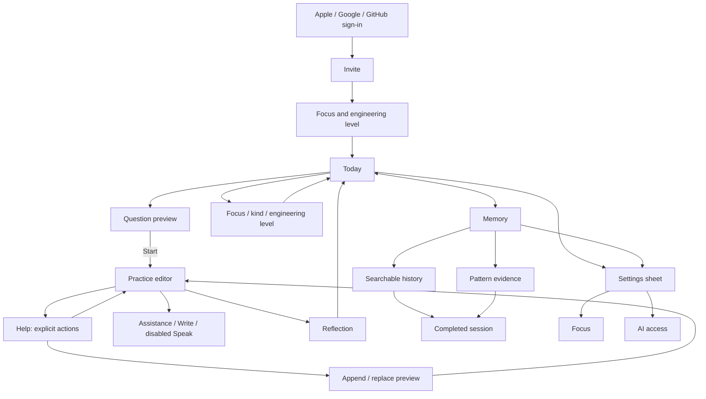

# Drillbit native architecture

This document describes the implemented baseline. The [product council vision](product-vision.md) records the complete direction. The active text-first experience is the Interview room described below; legacy Solo/Coach/Guided contracts remain compatible. Live voice remains deferred.

Drillbit is an iOS 26+ interview practice utility. Today and Memory are the two tabs; Settings is a native sheet. Practice is a full-screen interview with one active answer, explicit sharing, conversation history and an Ask interviewer sheet. Apple keyboard dictation is the speech input for this version. Spoken interviews, subscriptions and Android UI are deferred.

## Navigation

Navigation stays native: tabs select the two permanent destinations, stacks drill into details, sheets contain settings and assistance, and practice owns a full-screen presentation. A local/cloud revision conflict interrupts with an explicit recovery sheet.

## Boundaries

- `apps/ios` owns presentation, native integrations, local drafts and the durable outbox. SwiftData has a versioned schema and an actor-isolated store. Views call AppModel/application services, never SQL.
- `apps/api` owns authenticated account scope, shared lifecycle, generation, coaching, summaries and schedules. Hono adapts HTTP; store operations enforce conditional mutations; AI and Cloudflare Workflows are separate modules.
- `packages/contracts/openapi.json` is the HTTP boundary for Swift and future Kotlin clients. Generate it with `bun run contracts` after contract changes.
- `legacy/expo` is reference material, excluded from the workspace and every new build. Its existing modifications were preserved. The pre-rebuild source snapshot is also outside this checkout at `/Users/dawi/dev/drillbit-before-native-20260908-212600`.

## Practice and sync

A database constraint permits one ready/in-progress challenge per account. Prepared scheduled candidates are separate from active work. Completed answers are frozen; summaries never gate completion. A completion batch checks the expected draft revision and tags the successful mutation with its idempotency command before dependent lifecycle/job writes can proceed. A rejected revision cannot partially complete a session.

Drafts persist locally before cloud writes. The outbox holds the payload, server revision and stable command ID. A newer edit arriving during a network request survives acknowledgement of the older edit. Offline completion remains queued. Revision conflicts preserve the local draft and expose the cloud version for explicit recovery; completed cloud sessions cannot be reopened by a stale client.

Help is a durable job with a stable ID, action kind, assistance mode and draft revision. Opening/dismissing the sheet or switching modes never generates. One active help job per account is enforced in D1. Results survive dismissal; explicit Stop cancels pending/running help, and late results cannot be stored after completion. Help has no automatic provider retries; other existing durable jobs retain bounded retries. The legacy SSE endpoint remains for compatibility, but the native flow no longer uses it.

`practice.ts` owns help and adoption operations. Outline/example text is read-only until explicitly adopted. Suggested drafts have a separate schema field. Preview precedes append/replace; D1 atomically records the source, old/new answer and revision. Undo requires the insertion's exact revision. Later edits invalidate undo. Ambiguous native adoption requests persist their command and input; the editor locks while the same command is reconciled, never silently overwriting a newer local edit.

Completion freezes the answer plus help, adoption and legacy-turn context into `completion_context` in the lifecycle transaction. Summaries read that immutable snapshot. Post-completion reference viewing cannot change reflection inputs. Generated help is conservatively treated as possible exposure; the UI does not claim it measured whether each response was read. Provider work can still incur charges after Stop; application cancellation cannot guarantee provider billing cancellation.

Preparation remembers focus/kind/difficulty per account on this device; the optional instruction affects one generation only. A replacement expires the previous ready question only in the successful insertion transaction, and never replaces in-progress work. Similar-question requests use an owned completed session's reflection and assistance context. They create fresh questions, not mutable revisions of a completed answer.

## Accounts and credentials

Clerk JWT template `drillbit` must contain `aud: "drillbit"`; API verification checks issuer, audience, signature and expiry. Authentication does not grant practice access until a single-use invite is redeemed. Every user-owned SQL operation is scoped to the internal account ID.

Managed OpenRouter keys are Worker secrets. BYOK is OpenRouter-only and AES-GCM encrypted, with account/credential binding in authenticated data. Keys never appear in public responses, prompt contexts or logs. Replacing/removing a key cancels dependent pending jobs; invalid BYOK never falls back to managed access. Removing an account revokes widget credentials immediately and schedules durable deletion of application data and Clerk identity.

The widget receives only a minimal challenge projection through App Groups or a read-only, expiring device token. Full answers, reflections and provider credentials are not widget payloads. Device credentials are stored in the shared Keychain group. Clerk session credentials use the application-only Keychain group.

## Scheduling and learning

The scheduler prepares a candidate 15 minutes before the configured local daily slot. It never expires in-progress work, keeps an existing ready question on generation failure, avoids a backlog of missed days and pauses unattended generation after seven days of inactivity. Calendar calculations use IANA timezones and Temporal, including DST. Local reminders carry generic copy. WidgetKit and background refresh remain best-effort; neither drives AI generation.

Context assembly preserves the current answer and latest request and trims older evidence to a bounded character budget. Generation, help, examples and reflection outputs are schema validated. Generated question specifications include kind, target skill, visible constraints and ambiguity policy. Private evaluator criteria are derived from the visible prompt/constraints rather than a separately generated rubric; internal criterion fields are excluded from public challenge projections. Repeated memory patterns need evidence from at least two sessions. Readiness percentages and synthetic proficiency scores are intentionally absent.

## Native rules

Use system typography, semantic colors, SF Symbols and system component geometry. Custom spacing uses 4-point increments; custom surfaces use a 12-point radius. Keep one main action per state and the editor as the dominant practice surface. Support Dynamic Type, VoiceOver and standard keyboard/dictation behavior. No Expo, web views or third-party UI suite in the new application.

## Model and prompt policy

`google/gemini-3.1-flash-lite` is the only provider model for managed and BYOK requests. The provider enforces the constant independently of settings or queued job snapshots. Migration 0004 updates stored preferences; reads normalize older snapshots. The native model picker is removed. All actions use versioned `companion-v1` task instructions with a shared concise, warm tone layer. Tone is inspired by the user's Poke reference; it does not reproduce private prompts.

Run `bun scripts/check-practice-model.ts` and `bun scripts/check-practice-model.ts --edges` for synthetic live checks. They use the configured OpenRouter key and incur provider usage. Schema/boundary success is separate from human judgment of correctness and tone; see the current acceptance record.

## Contextual companion

[Companion specification](companion-vision.md) defines the implemented native bottom companion and mode boundaries. `InterventionPolicy` is pure; an observable coordinator owns activity, timing and presentation freshness. Views forward events; `PracticeCompanion` integrates persisted commands, account-scoped delivery receipts and HTTP. No voice transport is present.

Migration 0005 adds companion context, normalized interaction cycles, captured automatic requests and delivery receipts. Context mutations use revision checks and idempotency keys. D1 enforces shared automatic budgets, cooldown and duplicate-cycle rejection; `COMPANION_AUTO_ENABLED` controls rollout independently of manual help. Completion freezes pending delivery evidence atomically with the final draft. Generated, shown, uncertain and adopted help are distinct; unknown exposure is never classified as independent work.

Swift DTOs and the public OpenAPI contract are additive. Existing explicit-help clients remain supported. Native recovery uses account-scoped cached payloads rather than changing the stored-draft schema. Every automatic presentation also checks the local edit generation, mode epoch and captured context; reopened pending jobs are historical, not automatically fresh. See the acceptance record for observed checks and remaining device/product validation.

## Engineering levels and timezone preferences

Settings, onboarding and preparation use Intern, Junior, Mid-level, Senior, Staff and Principal (`intern`, `junior`, `mid`, `senior`, `staff`, `principal`). Optional `engineeringLevel` is additive to legacy `difficulty`; absent values normalize easy→junior, medium→mid, hard→senior. Legacy settings writes preserve a stored level. Explicit generation difficulty without a level maps that request only; new clients always send the level. Queued old snapshots normalize on execution, and newly generated challenges retain their level. Historical questions are not rewritten. Level affects visible question scope, never hidden evaluation requirements.

The native timezone list stores IANA identifiers, includes saved/device zones and offers a one-time device-zone selection. Saving does not follow subsequent device-zone changes. Daily clock minutes remain fixed; D1 scheduling and local calendar notifications use the selected timezone with DST rules. Settings retain Done-to-save behavior. LLM provider is the renamed AI access destination, with the same fixed Gemini/OpenRouter configuration.

## Compact Today summary

When no question is active or generating, Today shows Completed, Last 7 days, the latest completed session title with its recorded engineering level and localized completion date/time, and New question. `/v1/memory` adds optional `statistics` with `completed`, `lastSevenDays` and `asOf`; counts are account-scoped across all completed challenges, independent of the 100-session history page. Last 7 days is a rolling 168-hour window at `asOf`. Older cached payloads show unavailable counts rather than inferred totals, and snapshots older than five minutes show their update time. Accessibility text sizes stack the metrics vertically. Existing active-question navigation is unchanged.

Last-session metadata uses the level captured on that question, never the current settings. Legacy sessions map recorded Easy/Medium/Hard to Junior/Mid-level/Senior. Records missing both fields show Level not recorded. Absent or invalid completion dates are omitted.

## New-question brief

Preparation uses shared focus presets (including the user's current custom focus), target-level and format pickers, a visible optional request and Prepare question. Each presentation initializes from global focus/level with auto format and empty request. Local selections never update Settings or persist as subsequent defaults. Prepare generates a preview; Start still begins the attempt. Review's Practise this next opens the same sheet with removable source feedback and a link to session details. The server's existing follow-up snapshot now includes bounded submitted answer and delivery/capture facts alongside adoption history; generation is instructed not to infer mastery or change the requested level from recent history.

## Persistent Today and question previews

Today always renders activity counts and latest-session metadata. A separate compact area renders generation status or the ready/in-progress question title, topic, recorded level and Preview/Resume action. Full prompts are absent from Today. Native scrolling and bottom safe-area padding keep actions reachable above tabs.

QuestionFlow coordinates preparation and preview inside one sheet. Explicit preparation shows loading then the exact generated question in that sheet. Close preserves the question/job; backgrounding dismisses the flow and never reopens it. Scheduled/background results only update Today. Preview shows only the title and full prompt, with intrinsic multiline text height inside its scroll view; topic, level and interview style remain outside this reading surface. The body scrolls independently of a safe-area-inset Start/Choose another footer. Generation uses a full-width, vertically centered loading status; inline loading surfaces reuse the same spinner/text alignment. Start errors remain inline; the editor is presented after server Start succeeds and the sheet has dismissed. Resume retains offline draft recovery. Account checks prevent late results being presented under another account.

Existing generation/detail/Start APIs and ready-question replacement semantics are reused. Local failures preserve the submitted brief for Review preparation; unresolved backend jobs retain existing job reconciliation. No schema or public API change. This supersedes the earlier Today full-question layout and per-question cache defaults.

## Interview room — 9 September 2026

The active native workspace is now `InterviewView`, replacing the Solo/Coach/Guided selector with explicit turn-taking. The older companion implementation and public APIs remain for compatibility and historical assistance; its timers are not mounted in the new workspace. Today and the preview route are unchanged. Start interview opens a writing canvas; Share answer commits a snapshot, then a separate durable job produces a single follow-up. The … menu holds Ask interviewer, Conversation and the recorded interview style; the bottom bar retains voice and Share answer. Ask interviewer opens clarification, nudge and read-only example actions without sharing or replacing the draft. Conversation preserves prior turns, including in completed-session detail. Live voice remains disabled.

Interview style is a temporary preparation choice: Quick, Standard (default), In-depth. It is stored with generated questions as `quick`, `standard`, `in_depth`, independent of engineering level and global settings. Older questions default to Standard. Quick permits one initial follow-up, Standard up to two, In-depth up to four before a deterministic wrap-up offer; the model may offer an earlier wrap-up. These are ceilings rather than mandatory rounds. Keep going explicitly requests an additional question, followed by another wrap-up offer. No automatic completion or inference from typing pauses.

Migration `0006_interview.sql` adds ordered `interview_turns` linked to durable jobs. `POST /challenges/{id}/interview` accepts an answer/clarification/hint/example/continue command with draft revision, current prompt identity and idempotency key. A D1 batch creates the turn/job and increments the session revision; only an answer clears the active draft. Competing requests cannot share the same revision or leave a partial turn. Account-wide single-flight and per-account/attempt limits bound requests. `POST /challenges/{id}/interview/{turn}/retry` retries a failed response with a new job while retaining the original committed answer. Workflow automatic retries are disabled for interview inference.

Native pending commands are persisted before submission in the account-scoped DiskStore cache. Ambiguous requests retain their original command and lock submission until reconciled. The existing draft outbox preserves offline typing and conflicts. Restoration reads existing state; replay does not create another answer or paid job. Completion remains revision checked, cancels pending interview work and freezes the ordered transcript alongside any unshared final draft. A late model response cannot alter a completed interview. Generated assistance is conservatively recorded as unknown exposure; no claim of independent work is inferred from missing receipts. Examples in the new Ask sheet are read-only; the legacy revision-checked adoption APIs remain supported.

The sole model remains Gemini 3.1 Flash Lite. `interview-v1` separates follow-up/wrap-up schemas from clarification/help replies, preventing a clarification response from advancing the turn. Wrap-up copy is normalized by the server. Long histories are bounded by dropping oldest context turns with an explicit omitted-turn count; complete stored history remains intact, and reflection instructions restrict conclusions to available evidence. Current answer and current prompt are retained. Broader long-interview reflection quality remains a product acceptance concern.
