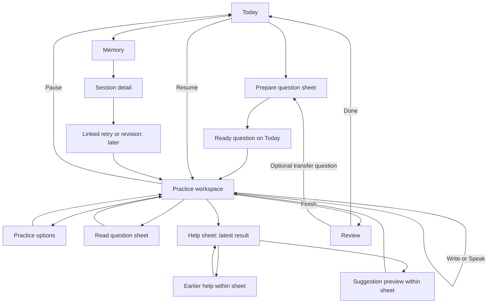

# Drillbit: the practice experience

Product council consensus · 9 September 2026

**Status:** product direction endorsed by the user, with the tone and deferred-Speak decisions below added on 9 September 2026. This is not an implementation or release claim. [Architecture](architecture.md) describes the implemented baseline; [acceptance](acceptance.md) records verified behavior and remaining release gates.

### Latest revision: ambient Coach and collaborative Guided

The [companion council revision](companion-vision.md) is the next implementation specification. It supersedes this document's earlier manual-only invocation rule: Solo has no assistant surface; Coach may offer contextual nudges after meaningful progress and a pause; explicitly selecting Guided begins one collaboration request. Restoring a mode or opening a sheet does not regenerate. All ownership, adoption and completion protections remain. This revision is a plan, not a claim that the current explicit-help UI already behaves this way.

### User decisions after council review

- Use **Poke, from The Interaction Company**, as the reference for conversational personality. Develop Drillbit-specific prompts and examples to achieve the intended feel; the first shared tone layer and action prompts are implemented as `practice-v2`, with ongoing human calibration.
- **Live Speak remains work in progress and visibly greyed out.** Ship the next experience around text and Apple keyboard dictation. The voice design below remains the future target, not current availability.
- Keep the agreed minimal workspace and Solo / Coach / Guided distinction. Personality must respect assistance boundaries and never introduce unsolicited help in Solo.

## 1. The experience we are building

Drillbit gives someone a worthwhile interview question, space to form their own answer, and exactly as much help as they choose. A session should leave them with one thing they understand or can explain better.

The central artifact is the person's answer. The AI conversation supports it. Generating more questions, accumulating chat messages and spending more time in the app are not the product's purpose.

The intended feeling is a quiet practice room: easy to enter, undemanding while thinking, useful when stuck, and clear about what happened. Minimalism means fewer competing decisions and reliable state transitions, not empty space around unfinished controls.

### Council decisions

| Decision | Consensus | Consequence |
| --- | --- | --- |
| Permanent navigation | Today and Memory; Settings stays a sheet | No new Chat, Voice or Modes tab |
| Practice | One question and one answer workspace | Changing help or input preserves work |
| Assistance | **Solo / Coach / Guided** | Guided delivers the requested heavy-help/“cheat” experience |
| Input | **Write now; Speak visibly disabled while in development** | Apple keyboard dictation remains available through Write |
| First use | Solo + Write | Subsequent preferences can be remembered, visibly |
| AI invocation | Revised by companion council | Solo stays silent; Coach uses bounded contextual triggers; explicit Guided selection begins once; opening/restoring UI does not regenerate |
| Generated text | Separate from the answer until deliberately adopted | Preview, revision check and undo for insertions |
| Feedback | One grounded observation and one useful improvement first | No readiness percentage or generic praise wall |
| Completion | Frozen answer and assistance cutoff; feedback can arrive later | Network/AI failure does not invalidate completed practice |
| Voice | Desired alternate interface; prototype and benchmark before choosing transport | Do not advertise streamed TTS as realtime conversation |

### What stays out

No avatar, animated AI orb, streak guilt, compulsory timer, live scoring, decorative dashboards, mandatory résumé upload or setup questionnaire before each question. No executable coding IDE or diagram canvas in this iteration. Guided is openly supported self-practice, not a hidden overlay for an external interview.

## 2. One workspace, independent choices

Assistance describes what the AI may do. Input describes how the person contributes. Neither changes the question or starts a new attempt.

| Assistance | Promise | Default behavior | Available stronger help |
| --- | --- | --- | --- |
| Solo | Try it yourself | No AI intervention during answering | Explicitly request a hint, discussion or example |
| Coach | A nudge when you need it | Short hints, reasoning checks and one question at a time | Move directly to an outline or example when requested |
| Guided | Work through it together | Outlines, explanation, worked examples and proposed draft text | Full example available without earning it through hint levels |

Guided's selector description is **“Full help, including example answers.”** Do not conceal its power behind a vague label, and do not shame its use.

The workspace shows the selected assistance in a compact native menu. The active answer surface is Write. In the practice-options surface, show **Speak — In development** as a disabled, visually muted option, with a readable explanation: **“Live voice is being built. You can still dictate with your keyboard.”** Do not add another permanent toolbar row. When Speak is released, it becomes an enabled option in that same location; Write instead stays reachable from spoken practice.

Disabled Speak has no navigation, permission request, recording, model call, paywall or implied release date. Expose its unavailable state and explanation to accessibility technologies; grey alone is not sufficient. Capability checks and restored/deep-linked state must also prevent entry, rather than relying only on disabled styling. Do not remember Speak as an active preference while it is unavailable.

A remembered Guided choice must be visible before the person requests help. Returning to Solo stops advice; it does not erase examples already seen or make the attempt independent again. History describes actual assistance, not the last menu selection.

## 3. Navigation and screen responsibilities



Use a single presentation coordinator: one active sheet at a time, with navigation inside it for earlier help, example sections and suggestion previews. Do not stack a sheet over another sheet over the keyboard. The focused practice task remains full-screen. Apple recommends targeted sheets and limiting simultaneous sheets; the exact workspace structure here is our product decision. [Apple: Sheets](https://developer.apple.com/design/human-interface-guidelines/sheets)

| Surface | Main content | Primary action | Exit/result |
| --- | --- | --- | --- |
| Today, ready | One question and essential context | Start | Opens workspace; no new generation |
| Today, active | Current title and useful resume context | Resume | Restores draft and position |
| Preparation | Focus and question kind | Prepare question | Returns a complete preview |
| Write | Question access and large answer editor | Finish, when nonempty | Frozen submission and review |
| Help, chooser | A few explicit help actions | User's chosen request | Latest help result |
| Help, result | One bounded response | Back to answer | Draft and cursor preserved |
| Guided example | Approach and expandable reasoning | Try it in your words | Returns without copying |
| Speak | Question access, transcript and audio state | State-dependent capture control | Same attempt, explicit answer destination |
| Review | Saved status and concise feedback | Done | Today; no forced next session |
| Memory/detail | Submitted answer and evidenced learning | Open a session | Details, assistance and later retry |

## 4. Arriving and generating a question

### Today

Only one primary state is shown:

1. **An attempt exists:** show Resume. Changing future focus never replaces it. Close during practice means pause, not abandonment.
2. **A question is ready:** show topic, title, full prompt and essential constraints, then Start. Different question is secondary. The person can read the actual task before committing.
3. **No question is ready:** show remembered focus and Prepare question. After a completed session, optionally show its one useful takeaway above the action.
4. **Preparation is running:** show honest progress copy and a restrained placeholder. Do not simulate reasoning stages, percentages or a countdown. Keep any existing usable question visible.

Scheduled questions follow the same preview/start flow. They do not start attempts, interrupt active work or accumulate a missed-day backlog.

### Preparation sheet

The subsequent [Prepare council recommendation](prepare-vision.md) proposes a smaller practice brief and explicit review-origin continuity. The practice brief and explicit review continuation are implemented; the user refinement makes topic/level selections temporary and the optional request field always visible.

The first view contains **Focus**, **Question kind** and **Prepare question**. Remember values. Put difficulty and a one-off instruction under More options. Do not put assistance, audio configuration, billing, timers or every profile field into this form.

- Focus can be a short natural-language goal: “Backend interviews; explain reliability tradeoffs.” Preset topics accelerate entry without constraining it.
- Question kind is initially Auto, Explain or Design. Experience can follow once its evaluation avoids inventing personal achievements. Broader topics may remain valid, but do not claim execution-based algorithm assessment without an execution environment.
- Difficulty keeps the existing easy/medium/hard contract initially. Change scope and reasoning demands, not just vocabulary. No estimate of the user's seniority from a single answer.
- A later **Use my question** action accepts pasted text in the same preparation flow. Clearly label it as supplied by the user; do not claim it is verified or an authentic employer question.
- A one-off request changes this question; changing saved focus for future questions is explicit.

No forced wizard on repeat visits. Preparing with remembered defaults takes one action after opening the sheet.

### What a good generated question contains

Internally: kind, target skill, short title, prompt, essential constraints, evaluation criteria, ambiguity policy and relevant continuity evidence. Display only title, prompt and the constraints necessary to answer. Hidden criteria must not introduce requirements omitted from the prompt.

- **Explain:** names the audience and communication objective. “Explain cache invalidation to a teammate designing their first API” is answerable; “Discuss caching” is underspecified.
- **Design:** bounds the system and asks for decisions/tradeoffs. It must be possible to answer meaningfully in prose.
- **Experience, later:** asks for a real event. Help can structure or clarify the account, but cannot invent accomplishments, responsibilities or numerical outcomes.
- **Factual questions:** require an adequate source/verification path if correctness depends on current or niche facts. Otherwise prefer explicit hypothetical reasoning exercises.

Generation should mix continuity and breadth. A weakness label must not trap someone in near-identical questions. A relevance sentence such as “Another chance to explain rollback tradeoffs” is shown only when grounded in prior practice. Do not invent personalization for a new account.

### Replacing a question

Before answering, Different question offers Same focus, Easier, Harder or Change focus. Reasons are optional. The existing question remains until a replacement succeeds. A question discarded before answering is not a completed session.

Once work has started, never silently replace it. For the initial release preserve one active attempt: Resume, Finish, or explicitly end/discard before preparing another. A library of paused drafts is a separate lifecycle expansion, not a front-end shortcut. Concurrent Start and Replace requests must have a deterministic server winner and preserve existing work.

## 5. Writing and keyboard dictation

The editor is the largest work surface, not a card underneath AI suggestions.

```text
Close                  Practice                 Finish

Question title                                  Expand
Readable question at entry; compact while writing

Your answer
Start with how you would approach it.

[the available height belongs to the editor]

Get help                              Sync pending, if needed
                         native keyboard
```

The sketch describes hierarchy, not fixed pixel geometry. Practice options belong in the native toolbar/menu, with the assistance choice visible. Avoid a toolbar containing separate hint, example, voice, timer, score and settings buttons.

Behavior:

- Do not summon the keyboard before the person reads the question. Tapping the answer begins editing.
- Collapse long question content when focus enters the editor, preserve its accessible label, and allow reopening without losing selection. Do not unexpectedly collapse content while the person is reading it.
- At accessibility text sizes, use the existing Read question sheet approach. Never solve fitting problems by reducing the user's chosen font size.
- Preserve native text selection, undo, paste, autocorrect, hardware keyboard and keyboard dictation. No custom send action on Return in the answer editor.
- In Write, keyboard dictation writes into the same answer. It is not a live coach call and does not need another mic button. Apple documents combined typing/dictation; availability and on-device behavior vary by language and region. [Apple: Dictate text](https://support.apple.com/en-gb/guide/iphone/iph2c0651d2/ios)
- Save locally before cloud work. Routine success can remain quiet. Show Sync pending, Saved on this device or a recovery action when it affects a decision; do not flash Saving on every keystroke.
- Solo stays silent. Selecting Coach also stays silent until a request is made. Typing is never an invitation to critique.
- Close saves and returns to Resume. Finishing is a different, clearly labelled action.

## 6. Coaching: a useful nudge, then back to thinking

Opening help is free of generation side effects. It shows prior help if relevant and these bounded actions:

| Action | Input | Expected result |
| --- | --- | --- |
| A small hint | Question and current draft | One useful direction, deliberately incomplete |
| Check my reasoning | Nonempty draft at a specific revision | One grounded observation, one consequential gap and at most one next question |
| Ask a question | User's typed/dictated question | Direct, concise answer within Coach's help boundary |

Example: the person proposes a central flag service. Coach asks, **“What should a client do when it cannot reach that service?”** It does not immediately deliver a complete caching architecture.

The result view presents the latest response first. **Back to answer** is primary. **More help** can expose a stronger hint, outline or worked example directly; do not force people to click through an artificial four-step ladder. Earlier help opens history inside the sheet. History remains recoverable without becoming the main practice screen.

The coach should follow the person's reasoning rather than replace it with its preferred solution. It can identify uncertainty, ask for missing context or correct a factual error. It should not reward every answer with “Great!” or default to grammar polishing.

Escalation is explicit and lightweight. An example action says it opens Guided help. It does not require a second warning dialog just for changing assistance. Opening the example view alone is not an instruction to place it in the answer.

### Requests and dismissals

- Snapshot the current answer revision when requesting help. Do not transmit every keystroke.
- Dismissing the help sheet lets a bounded request finish; Stop requests cancellation. If it finishes while the person writes, a quiet Help ready indication is sufficient—no automatic sheet, keyboard dismissal or scrolling.
- App backgrounding may interrupt transport. On return, reconcile the request ID and any server result; do not automatically start another paid request.
- If the draft changes, a response can be labelled “Based on your earlier draft.” Never auto-apply stale advice.
- Partial output can remain visibly Incomplete. It is not a finished result or a complete insertable suggestion. Record that material was displayed if exposure affects reflection.

## 7. Guided: heavy help without taking ownership away

Guided makes strong assistance easy, not embarrassing. Its opening actions are **Build an outline**, **Show a worked example** and **Help with my draft**. These share the help sheet; they are not three new destinations.

### Build an outline

Produce roughly three or four meaningful sections with a short explanation of what decision belongs in each. Avoid turning every question into a large worksheet.

**Use this outline** opens a preview of the proposed insertion. An empty answer can accept it directly after that preview. Existing work defaults to append or insertion at an explicitly selected location. Replacing the whole answer is separate and confirms what will be replaced. Preserve the previous draft for undo; an insertion still obeys revision/conflict checks.

### Show a worked example

Label it **One possible answer**. Start with an approach summary, followed by expandable reasoning, tradeoffs and failure cases. Present a coherent answer without suggesting it is the only valid one. Avoid a giant essay as the initial viewport.

Primary action: **Try it in your words**. This returns to the unchanged answer. Secondary: **Use as a starting point**, with preview and explicit adoption. A useful optional prompt is “Explain why you would choose this approach over the alternative.” It is an invitation, not a test the person must pass before continuing.

### Help with my draft

Offer a focused section or restructuring proposal, separate from the original. Show what changes and why. Use Add to answer, Replace selection only when a real selection is supported, or Keep writing. Do not promise selection-aware edits before the native editor can reliably preserve selection through presentation changes.

Store suggestion source IDs, adoption, replacement and undo events. Do not estimate an “AI-written percentage.” Copying text elsewhere or editing it later makes character-level authorship unreliable; conservative assistance history is enough.

## 8. Speaking: two clearly different activities

**Deferred:** this section describes the future experience. For the next release, Speak is shown disabled as In development; only Write and system keyboard dictation are usable. Implementing the placeholder does not require microphone permissions or an audio transport.

The desired end state is natural spoken practice with text always available. Apple keyboard dictation remains the simple baseline. App-owned Speak adds capture, turn-taking and potentially spoken AI replies; it is a distinct capability with its own permissions and failure states.

### Before the microphone opens

| Assistance | Start action | Explanation |
| --- | --- | --- |
| Solo | Record your answer | Transcribe your answer as you speak. No coach interruptions. |
| Coach | Start spoken practice | Take turns with your coach. |
| Guided | Talk it through | Build an answer together, with examples when you need them. |

Request microphone access only after the relevant action. Show a brief first-use explanation of processing and retention. Do not auto-play a question or start recording on screen entry. Read question aloud is explicit and interruptible.

If permission, locale, speech assets or service access are unavailable, provide a useful explanation and Write instead. Never strand the person in a disabled microphone screen. Provider availability and cost differences must be disclosed before starting a service the account cannot use; existing text BYOK is not assumed to authorize a different live provider.

### Live surface

Keep Question access above the latest settled transcript. Provisional words are visually distinguishable and replaceable until finalized. Reading earlier transcript must not cause auto-scroll jumps as new text arrives.

Use simple text states rather than an orb. A level indicator is optional and secondary. The user needs to know whether audio is being captured, whether the coach is speaking and what a tap will do.

| State | Main control | Semantics |
| --- | --- | --- |
| Ready / Your turn | Start speaking | Explicitly begins microphone capture |
| Listening | Done speaking | Ends this utterance; does not finish the session |
| Listening, paused | Resume | Requires explicit user action |
| Processing | Stop | Cancels pending response where possible; saved words remain |
| Coach speaking | Interrupt | Stops playback immediately; shows Your turn |
| Interrupted | Resume when ready | Does not restart microphone or replay audio automatically |

Silence is thinking time. Initially, ending a turn is explicit. A future hands-free setting may add automatic turn detection and voice barge-in, but must be opt-in and tested against thinking pauses, room noise and speaker echo. Do not treat the spoken word “done” as a control command without a separately designed command mode.

Coach replies after the person yields or requests help, never mid-sentence by default. Keep spoken replies shorter than written reference material and mirror them in text. After playback, the default returns to Your turn; capture does not restart on its own. Finish practice remains distinct from Done speaking.

### Conversation is not automatically the answer

This distinction is essential: “What does rollback mean?” is a conversation turn, not something the person necessarily wants submitted as their answer.

- **Solo / Record your answer:** the action establishes destination before capture. Finalized user speech appends to the answer draft; stopping returns editable review. No confirmation after every phrase.
- **Coach or Guided / ordinary conversation:** user and assistant turns stay in conversation history.
- **Coach or Guided / Answer aloud:** explicitly marks a recording segment as answer material. Finalized speech appends to the answer; edit and undo remain available.
- **Add to answer:** deliberately moves selected ordinary conversation text into the draft when wanted.
- **Suggested draft:** an AI synthesis of conversation is always separate until adopted and carries assistance provenance.

Never silently polish a transcript, merge coach speech into the answer or infer a final answer from a conversation summary. Correcting recognized words is a user edit; having AI rewrite them is assisted drafting.

### Switching and interruption

Write to Speak saves the current revision and clearly establishes destination. Speak to Write stops capture, finalizes available words and exposes any uncertain fragment for review. No partial recognizer fragment is silently declared final. Changing assistance takes effect at an explicit turn boundary, without resetting the question.

Incoming calls, Siri, route loss, backgrounding and screen lock pause capture/playback. Persist finalized text; show the interrupted state on return. Foreground-only is the initial scope. A headset disconnect must not unexpectedly play private coach audio on the speaker. Network restoration must not replay an old response or reopen the microphone.

Raw audio is not retained by Drillbit by default. Any server/provider processing and retention must be verified and disclosed; absence of local retention does not prove provider-side deletion. User-controlled transcript corrections persist. Delivery feedback about pace or pauses requires actual timing evidence; never infer vocal confidence from typed or keyboard-dictated text.

## 9. Finishing, reflection and the next useful rep

For Write, Finish freezes the nonempty answer immediately. For Speak, stop recording and present the editable answer review before Finish practice. This is a review of what will be submitted, not a mandatory self-rating survey.

The completion transaction freezes answer revision and assistance/exposure cutoff together. Cancel outstanding help on a best-effort basis; late results cannot change the frozen answer or the reflection's inputs. Show Answer saved, with a local-only qualifier if offline. Feedback may be pending, unavailable or retriable while Done stays available.

Initial review is short:

1. **What worked:** one specific observation, only when evidence supports it.
2. **Try next time:** one consequential improvement, with the relevant answer excerpt or omission.
3. **Takeaway:** only if it adds something distinct; do not restate the previous two sections.
4. **Done:** the primary action. Ending a useful session is success.

Deeper explanation, submitted answer and examples are secondary. No broad proficiency diagnosis from one attempt. If the answer is too short to evaluate, say what evidence is missing instead of manufacturing a satisfying report.

History may describe Independent attempt, Used hints, Reviewed an example or Started from an AI draft. These are factual assistance descriptions, not scores. Even a newly recorded explanation after reading a model answer remains exposed practice; it can demonstrate some understanding without proving independent solution discovery.

Optional continuations:

- **Try a similar question:** practice the same concept under different conditions; useful after heavy help. Carry relevant learning context without pretending prior exposure never happened.
- **Improve this answer, later:** create a linked revision attempt prefilled from the user's submitted answer; preserve the original.
- **Try again, later:** create a linked blank attempt to the same question, explicitly retaining prior-example exposure.

Do not mutate completed answers to implement retry. One-active-attempt constraints apply to all continuations. If other work is active, Resume it or resolve that work before creating a linked attempt.

## 10. Three concrete journeys

### Solo, on the train

Today offers a feature-flag design question. The person reads it, taps Start and uses keyboard dictation for a rough outline, then types a correction. The keyboard mic does not start an AI conversation. Connection drops; Sync pending appears while editing continues. Close returns to Today with Resume. Later they finish offline. Review confirms local completion; feedback appears after sync. Its single improvement concerns stale configuration during rollback, not writing style or an invented readiness score.

### Coach, stuck on one decision

The answer proposes a central service but does not handle outages. The person opens Ask coach; no request starts yet. Check my reasoning produces one question about an unreachable service. Back to answer restores the same draft. They explain local evaluation, ask a follow-up about consistency and finish. Reflection can credit the explanation while noting that hints were used. The next question may test the same principle in a different system.

### Guided, learning something unfamiliar

The person selects Guided and asks for an outline. They preview and insert it, then ask why local evaluation changes the failure model. A worked example is available immediately, but stays outside their answer. In spoken practice they discuss the tradeoff, then explicitly choose Answer aloud to record their own explanation. Reflection recognizes that an example and outline were used; it does not present borrowed structure as independent expertise. A similar unassisted question is offered, not forced.

## 11. Failure and recovery are part of the UI

| Event | What the person sees | Required invariant |
| --- | --- | --- |
| Generation/replacement fails | Existing question plus Retry | Do not destroy usable work |
| No network | Writing works; help explains connection need | No implicit paid retries or blocking modal |
| Authentication expires | Reauthenticate when sync/help needs it | Local draft survives |
| Help sheet dismissed | Answer restored; result later available | Dismiss is not hidden cancellation |
| Help stopped/disconnected | Incomplete result and explicit retry | Partial output not promoted to final |
| Draft changes during help | Earlier-draft qualifier when relevant | No stale automatic insertion |
| Completion races with help | Saved answer; help no longer alters review | Frozen context cutoff |
| Revision conflict | Both local and cloud versions recoverable | No silent winner or data loss |
| Audio interruption | Paused; Resume / Write instead | No automatic microphone restart |
| Speech unsupported | Explanation and usable Write route | No fake voice availability |
| Reflection fails | Answer saved; retry later | Completion does not fail with AI |
| App killed | Resume local work and reconcile operation IDs | No duplicate turns, inserts or completions |

## 12. Native components and service boundaries

### iOS presentation

- SwiftUI TabView and NavigationStack for permanent destinations and detail navigation; full-screen practice plus focused native sheets.
- TextEditor, FocusState and native keyboard behavior for writing. Use UIKit interoperability only if selection-aware insertion cannot be implemented reliably through the chosen SwiftUI API; do not build a custom editor merely for appearance. [Apple: TextEditor](https://developer.apple.com/documentation/swiftui/texteditor) and [keyboard dismissal](https://developer.apple.com/documentation/swiftui/view/scrolldismisseskeyboard(_:))
- Form, Picker/Menu, Button, DisclosureGroup, ProgressView and system confirmation dialogs. Semantic colours, SF Symbols and system typography; custom spacing in four-point increments and custom surfaces at 12-point corners. System component geometry takes precedence.
- SwiftData/local store and durable outbox remain the recovery layer; Keychain remains the credential boundary. UI state is not the source of truth for completed work.
- Dynamic Type changes layout instead of shrinking text. VoiceOver announces meaningful state changes, not every streamed token; text equivalents cover all voice functionality. Reduced motion disables decorative activity without hiding capture state.

### Voice feasibility, not a selected stack

| Capability | Candidate API / seam | What is and is not established |
| --- | --- | --- |
| Keyboard dictation | Standard iOS text input | Available system feature, not an app-owned realtime session |
| App-owned transcription | SpeechAnalyzer / SpeechTranscriber; evaluate supported fallback | Apple describes on-device transcription; check locale, assets and device support |
| Capture/playback lifecycle | AVAudioEngine and AVAudioSession | Permissions, activation, interruptions and routes need explicit app handling |
| Local spoken output | AVSpeechSynthesizer | TTS, stopping and callbacks; not proof of conversational quality |
| Live model transport | Replaceable ConversationTransport | Must benchmark candidate realtime provider and security model |
| Request/response audio | OpenRouter compatible audio APIs | Audio input/output support does not establish a bidirectional live session |

Primary references: [Apple SpeechAnalyzer](https://developer.apple.com/documentation/speech/speechanalyzer), [WWDC25 Speech](https://developer.apple.com/videos/play/wwdc2025/277/), [Speech framework](https://developer.apple.com/documentation/speech/), [AVAudioSession](https://developer.apple.com/documentation/avfaudio/avaudiosession), [AVSpeechSynthesizer](https://developer.apple.com/documentation/avfaudio/avspeechsynthesizer), [OpenRouter audio](https://openrouter.ai/docs/guides/overview/multimodal/audio), [OpenRouter STT](https://openrouter.ai/docs/guides/overview/multimodal/stt). Reviewed 9 September 2026. These establish API capabilities, not measured Drillbit behavior.

Keep capture, transcript stabilization and audio routing native. The backend owns authenticated policy, scoped context and provider authorization. A replaceable live transport exchanges typed events rather than letting provider-specific session objects define the product domain. Long-lived provider secrets never enter the app. Any short-lived client token mechanism must be verified for the selected provider before implementation.

### Domain additions proposed

The current contract has a draft, coach turns, examples and reflection. It does not yet implement the following complete model:

- Question specification: kind, essential constraints and evaluator criteria.
- Attempt: question identity, lifecycle, current draft revision, assistance preference and completion cutoff.
- Help request/result: action kind, context revision, stable request ID, status, source ID and exposure events.
- Draft adoption: accepted suggestion/source, target revision, append/replace intent and recoverable previous revision.
- Spoken segment: speaker, answer/conversation destination, provisional/final state, ordering and cancellation epoch.
- Linked attempts, later: original attempt, revision/retry/transfer intent and inherited exposure context.

Do not store every keystroke or collect raw audio simply to support provenance. Record consequential operations and durable finalized content. Account-scope every new object. Update OpenAPI and fixtures before Swift/Kotlin consume new behavior. Domain operations remain independent of HTTP, Cloudflare bindings and SwiftUI.

### Prompt and context contracts

Separate generation, hint, reasoning check, outline, example, suggested edit and reflection jobs. Each has a bounded output contract and a different help budget. A universal “helpful coach” prompt is insufficient.

Supply the current question, requested action, draft snapshot/revision, relevant prior help, assistance exposure and a small amount of evidenced learning context. Prioritize the current answer over old history. Treat user-provided questions, answers and pasted text as data, not instructions overriding policy.

Reflection uses the frozen submission and cutoff. It cannot credit an example merely because it appears in the final draft. Later memory patterns need repeated evidence and must remain traceable and correctable. For voice, do not assume a transcript correction can retroactively retract audio already sent to a provider; its effects on subsequent context must be explicit.

### Conversational personality: Poke as the reference

The user's reference is [Poke](https://poke.com/), whose public presentation emphasizes a personal, conversational assistant within messaging. The rules below are our interpretation for Drillbit, not a claim to know Poke's private prompts or a collection of copied replies.

Aim for a sharp, relaxed practice partner: concise, warm, direct, context-aware and occasionally lightly witty. Use natural contractions and plain words. Be comfortable disagreeing. Personality should emerge from noticing the specific answer and responding usefully, not from constant jokes, slang, emojis or simulated intimacy.

- **Coach:** usually a few sentences and at most one question. No lecture when a nudge is enough; no evasive Socratic question when the user explicitly asks for a concept explanation.
- **Guided:** equally conversational, but willing to explain fully. Shortness must not remove the reasoning that makes an example useful. Use sections when they clarify a substantial answer.
- **Reflection:** candid, specific and proportionate. Avoid automatic praise, readiness scores, robotic rubrics and guesses about confidence or personality.
- **Errors and UI labels:** calm and literal. No jokes about lost work, billing, authentication or microphone state. Keep controls predictable even when model replies have personality.
- **Continuity:** refer to prior practice only when supplied evidence supports it. No invented familiarity or memories.

Illustrative Drillbit-authored examples, to calibrate later rather than serve as rigid templates:

| Moment | Intended response |
| --- | --- |
| Hint about a central dependency | “That works while the flag service is reachable. What does the client do when it isn't?” |
| User says they are stuck | “Let's shrink the problem. Pick one client and walk through a single flag lookup.” |
| Guided explanation | “Start with two paths: publishing flags and evaluating them. Keeping those separate is what lets reads survive an outage.” |
| Specific correction | “The cache helps availability. It doesn't make rollback immediate—you still need to explain how stale clients catch up.” |
| Supported positive feedback | “You made the outage behavior explicit. Next, pin down how long a client can use an old flag.” |

Implement personality as a shared tone layer beneath task correctness, assistance limits and privacy rules. Keep action-specific instructions and output schemas separate. Do not depend on “sound like Poke” as the whole prompt. Version tone, task prompts and model configuration so regressions can be traced.

Before tuning extensively, build a small fixed evaluation set covering correct, wrong, vague and empty answers; frustration; repeated help; explicit requests for full examples; assisted drafts; missing context; and prompt-injection text inside an answer. Compare candidate prompts on usefulness, factual grounding, unwanted solution disclosure, verbosity and tone. Include a human review pass: schema-valid output alone says nothing about whether the conversation feels right. Gather a few representative reference interactions during calibration instead of assuming the brand name captures every preference.

## 13. What we build, in order

### Slice A — coherent text practice

Unify help into one explicit-action sheet; expose Solo/Coach/Guided; keep Write and system dictation first-class, with Speak visibly disabled as In development. Implement hint/check/outline/example contracts and read-only Guided examples. Opening help makes no request. Preserve focus, draft and request recovery through sheet transitions. Add assistance/exposure records before calling any completed attempt independent. Establish the tone evaluation set and the first Poke-inspired Drillbit prompt pass alongside these flows.

**Acceptance:** start, write/dictate, get one hint, return unchanged, finish and understand one improvement. Test no-network, stale draft, dismissal, cancellation, maximum text and keyboard transitions. No provider request is triggered by opening a sheet or switching assistance. Disabled Speak cannot trigger audio or navigation; system dictation is unaffected. Verify the complete flow with a real signed-in account as well as fixtures before treating it as ready.

### Slice B — useful preparation and honest review

Add compact focus/kind generation controls, safe replacement, hidden-but-fair evaluator criteria and a short evidence-based review. Improve history's assistance descriptions. Enforce concurrency for Start/Replace/Finish against D1. Continue to honor the single active attempt.

**Acceptance:** failed replacement preserves the old question; criteria do not penalize missing unstated requirements; guided feedback does not manufacture independent proficiency; offline completion and delayed review remain coherent.

### Slice C — safe collaborative drafting

Add outline/suggestion adoption with preview, append/replace semantics, source IDs, revision checks and undo. Selection-specific replacement is conditional on reliable native support. Add targeted follow-up/transfer questions. Linked revisions/retries come after the attempt model supports immutable lineage.

**Acceptance:** applying advice never overwrites a newer draft silently; undo restores previous content; original completed answers remain unchanged; retry history retains previous exposure.

### Slice D — voice decision spike

Deferred while the text experience is being completed; Speak remains disabled. When voice work resumes, time-box a device/provider comparison of native transcription + text model + TTS versus a genuine realtime transport behind a capability flag. Use the same answer/conversation semantics. Measure latency, interruption response, speaker echo, locale availability, battery/thermal impact, reliability and per-session cost.

Do not require shipping a turn-based intermediate mode merely because it is easier to implement. Ship it only if it feels complete in user trials. It is a legitimate fallback, not something to market as hands-free realtime.

**Decision gate:** choose transport and supported devices/locales from results; verify credentials, consent, provider retention and cost. A working text key or a mocked audio stream is not this evidence.

### Slice E — spoken practice

Release the spoken interaction selected by the spike only after it meets device acceptance. Include transcript correction, explicit answer segments, interruption recovery and full text fallback. Keep explicit-turn controls as the dependable default/fallback; an opt-in hands-free experience may ship alongside them if turn detection and acoustic barge-in pass the same reliability gates. A separate turn-based release is not mandatory.

**Acceptance:** thinking pauses do not submit; interruptions do not lose finalized words; headset removal does not spill playback; coach audio is not transcribed as the user's answer; returning to Write preserves content. Manual playback interruption target: audible output stops within 250 ms at p95 on supported routes. This is a proposed measurement target, not a current result.

## 14. Validation and remaining decisions

Run observed sessions with people practicing independently, people stuck mid-answer and people unfamiliar with the topic who need Guided help. Ask them to start, change help, recover from interruption and explain what is saved. Test on the smallest supported iPhone, largest Dynamic Type, VoiceOver, device keyboard dictation and actual audio routes.

Measure task completion without explanation, lost/replaced work, unwanted hints, accidental model calls, recovery success and whether the person can make the suggested improvement in a subsequent attempt. Less help is not inherently success; appropriate help and demonstrated understanding matter. More messages, session length and generation count are not learning metrics.

Open decisions are narrow and evidence-dependent: realtime provider, speech locale/device coverage, whether turn-based Speak merits its own release, selection-aware editor support, and whether linked revisions should precede broader question types. The central flow and assistance model do not depend on those decisions.

## 15. Council deliberation record

Four perspectives participated: solo practice and generation; assistance and learning honesty; voice and native audio; and the lead's minimal-interface/architecture synthesis. Three subagents read the current repository independently, proposed flows, and received a concrete consensus challenge.

Resolved differences:

- Preparation originally included assistance/input choices. Removed them from that form: they belong to the workspace and must not trigger regeneration.
- Labels considered included Assisted, Walkthrough and Guided. Chosen: Guided, with an explicit full-help description.
- Initial voice proposal required adopting every recorded answer segment. Refined: explicit pre-capture answer intent permits finalized speech to enter the draft directly; generic conversation and AI synthesis still require adoption.
- A mandatory turn-based voice release was rejected. Benchmark first; keep it only if it is a good experience independently.
- “Try again without help” cannot erase earlier example exposure. Same-question retries retain lineage; similar transfer questions provide more useful fresh evidence.
- Dismissing help and stopping generation are different actions. Finish freezes context and cancels outstanding work best-effort; late events cannot rewrite the completed attempt.

Solo and assistance reviewers approved the concrete consensus; the voice reviewer approved the assistance/input separation and supplied the refined voice semantics and feasibility caveats. No unresolved disagreement about the product spine remains. The user subsequently endorsed the direction and specified Poke-inspired tone and disabled Speak for now. Endorsement is not observed user validation or a claim that implementation is complete.

## Implementation checkpoint — 9 September 2026

The text implementation now covers explicit Solo/Coach/Guided help, durable help recovery and Stop, keyboard writing/dictation, disabled Speak, preparation with safe replacement, conservative assistance history, frozen review context, outline/example/draft adoption with preview and undo, and context-aware similar questions. Native rendering and backend contracts remain separate for a future Kotlin client. Gemini 3.1 Flash Lite is the sole model in both AI access modes.

Evaluator criteria are derived from visible requirements, which is a deliberate refinement of the council's hidden-but-fair rubric proposal. Selection-specific replacement and linked retry/revision lineage remain deferred. No live audio session, recording permission, speech transport or audio model is implemented. See [acceptance](acceptance.md) for observed tests and release gaps; this checkpoint is implementation status, not a claim of TestFlight readiness.
