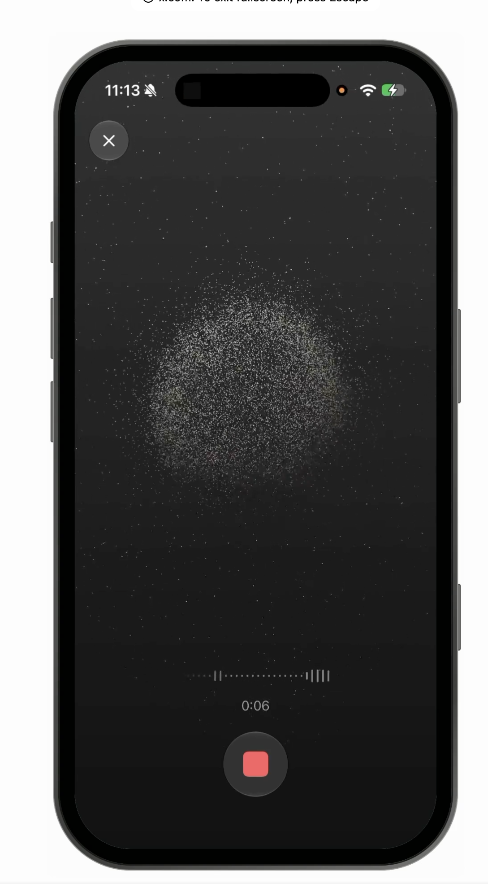

# Particle concept · voice presence

This is a second, isolated direction beside the existing contour lab. The image sets the visual hierarchy: a near-monochrome field, a concentrated cloud of fine particles, a narrow voice waveform, elapsed time and one coral transport control. The screen uses no cards or body copy. The current contour renderer and its tuning screen remain in their own files.

## Color roles

Colors below were sampled from the supplied screenshot. The native status-bar region is controlled by iOS and can appear darker than the drawn field.

| Role | Color | Use |
| --- | --- | --- |
| Upper field | `#414141` → `#373737` | Vertical atmospheric gradient |
| Lower field | `#262626` → `#181818` | Depth behind transport |
| Particles | `#D4D4D4`, `#8C8C8C` | Near and distant silver grains |
| Secondary ink | `#A2A2A2` | Waveform, timer and source |
| Control surround | `#414141` | Close and transport circles |
| Voice accent | `#F0817B` | Active tab and play/stop mark only |

No amber from the contour direction appears in this concept. The accent does not color the particle cloud; voice changes its shape and density rather than making it glow.

## Motion and interaction

The static field is built once from deterministic particle positions. A smaller live layer uses the existing 12 logarithmic frequency bands and UI-thread motion values. Low bands affect inner particles; high bands affect outer particles. Voice energy expands the cloud gently, adds local drift and lifts the near-particle opacity. The narrow dotted waveform follows the same signal, so both elements describe one voice state.

The play/stop control uses the bundled interviewer speech by default. The top-right source control offers band scan and sweep for testing. This first concept reacts to **local playback**, including recorded speech; live microphone capture and agent audio are not connected. The renderer remains separate from transport, so input and output voice can be passed in later. System Reduce Motion freezes the changing geometry while retaining the static field, waveform and accessible state.

The `Particle` tab is a test surface. Its native tab bar hides during the concept view; Close returns to the original `Orb Lab` tab for direct comparison. See [VERIFICATION.md](./VERIFICATION.md) for the native test boundary.
